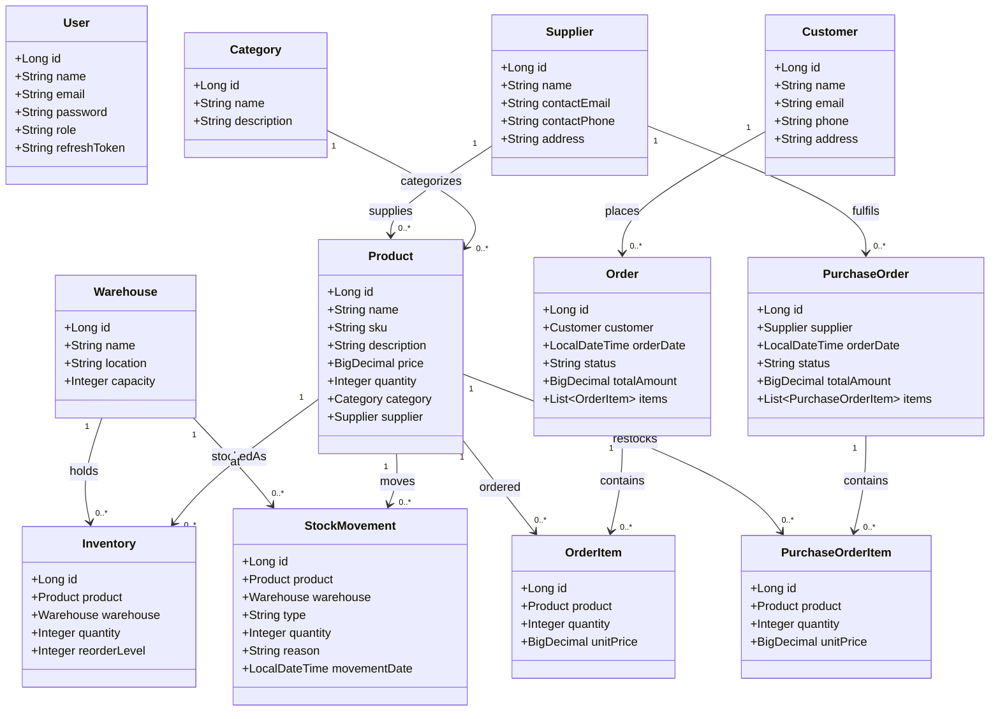
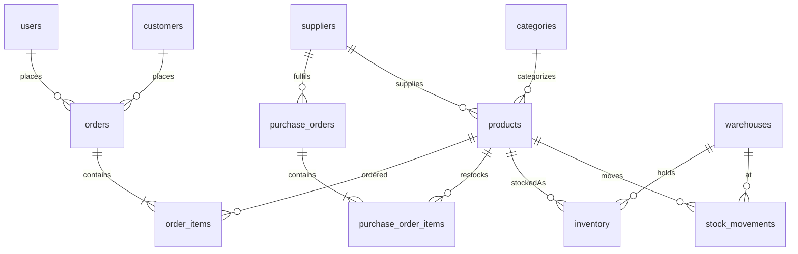
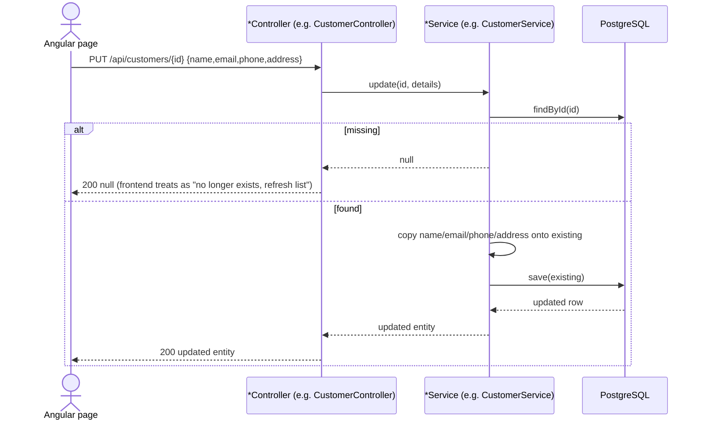
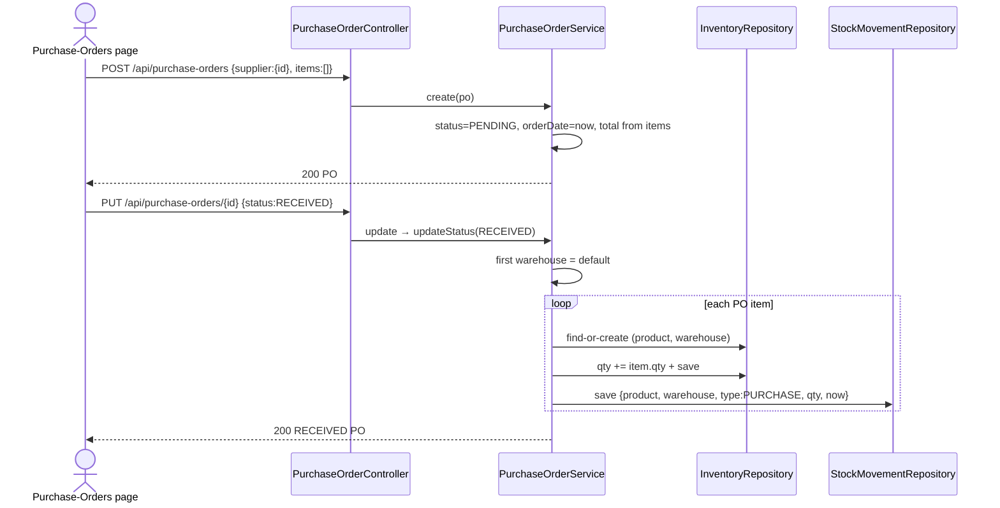
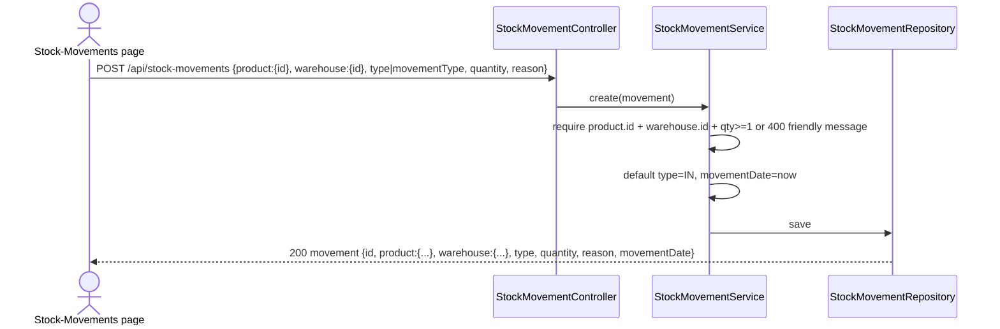

# RetailPro Backend — Architecture, Data Model & API Guide

Spring Boot 3 REST API for the RetailPro inventory system.
Base URL: `http://localhost:8080/api` · Auth: JWT Bearer · DB: PostgreSQL (`ddl-auto=update`).

## 1. Runtime structure

```
backend/
├── src/main/java/com/retail/inventory/
│   ├── InventoryApplication.java        # entry point
│   ├── config/
│   │   ├── SecurityConfig.java          # JWT filter chain, 401/403 JSON handlers, BCrypt(12)
│   │   ├── JwtAuthFilter.java           # validates Bearer access token per request
│   │   ├── CorsConfig.java              # allows Angular dev origin
│   │   ├── RateLimitFilter.java         # throttles auth endpoints (429)
│   │   └── SecurityHeadersFilter.java
│   ├── controller/                      # REST layer (no DTOs — entities are serialized directly)
│   │   ├── AuthController.java          # POST /auth/register|login|refresh|logout
│   │   ├── ProductController.java       # CRUD + ?categoryId&supplierId&search, 409 on FK conflict
│   │   ├── CategoryController.java      # CRUD
│   │   ├── SupplierController.java      # CRUD
│   │   ├── WarehouseController.java     # CRUD
│   │   ├── CustomerController.java      # CRUD
│   │   ├── InventoryController.java     # CRUD + /warehouse/{id} + /low-stock
│   │   ├── StockMovementController.java # GET list/filter + POST create (NEW)
│   │   ├── OrderController.java         # GET, POST createOrder, PUT /{id}, PUT /{id}/status, DELETE
│   │   ├── PurchaseOrderController.java # GET, POST create, PUT /{id}, PUT /{id}/status, DELETE
│   │   ├── DashboardController.java     # GET /dashboard/stats
│   │   ├── UserController.java
│   │   └── GlobalExceptionHandler.java  # friendly {message} mapping (400/409/500)
│   ├── service/                         # business logic + transactions
│   │   ├── OrderService.java             # createOrder: validates customer/product, checks inventory,
│   │   │                                # decrements stock, writes SALE movement, recalcs total
│   │   ├── PurchaseOrderService.java     # create: PENDING + total; updateStatus(RECEIVED):
│   │   │                                # creates/fills inventory, writes PURCHASE movement
│   │   ├── StockMovementService.java     # create: validates product/warehouse/qty, defaults type/date
│   │   ├── InventoryService.java
│   │   ├── ProductService.java
│   │   ├── CategoryService.java / SupplierService.java / WarehouseService.java / CustomerService.java
│   │   ├── DashboardService.java         # counts + pendingOrders + lowStock + totalQty
│   │   ├── UserService.java / JwtService.java
│   ├── model/ (JPA entities)             # see §2
│   └── repository/ (Spring Data JPA)
│       ├── ProductRepository.java       # findByCategoryId / findBySupplierId / findByNameContainingIgnoreCase
│       ├── InventoryRepository.java     # findByWarehouseId / findLowStock
│       ├── StockMovementRepository.java # findByProductId / findByWarehouseId
│       └── OrderRepository, PurchaseOrderRepository, CustomerRepository, ...
└── src/main/resources/
    ├── application.properties           # datasource, ddl-auto=update, jwt secrets/expiry
    └── application.yaml
```

Layered flow: `Controller → Service (@Transactional where stock changes) → Repository → PostgreSQL`.
Security flow: `RateLimitFilter → JwtAuthFilter → SecurityConfig rules → Controller`.

## 2. UML class diagram (entities as returned JSON)



Notes:
- No DTOs — nested objects are serialized (e.g. `inventory.product.name`, `order.customer.id`). Frontend must read `x.product?.id ?? x.productId`, never flat IDs alone.
- `StockMovement.type` accepts alias `movementType` (`@JsonAlias`) for the Angular form; `reason` is optional free text.
- `Product.quantity` is a simple on-hand default (detailed stock lives in `Inventory`).

### ER view (tables / FKs)



## 3. Sequence diagrams

### 3.1 Login / refresh (JWT)

```mermaid
sequenceDiagram
  actor U as Angular app
  participant A as AuthController
  participant DB as PostgreSQL
  participant J as JwtService
  U->>A: POST /api/auth/login {email, password}
  A->>DB: findByEmail(email)
  A->>A: BCrypt.matches(password)
  alt invalid
    A-->>U: 401 {message:"Invalid email or password"}
  else valid
    A->>J: generateAccessToken + generateRefreshToken
    A->>DB: save refreshToken
    A-->>U: 200 {accessToken, refreshToken, data:{id,name,email,role}}
  end
  U->>U: store tokens + currentUser
  Note over U,J: Later: POST /api/auth/refresh {refreshToken} → new pair; POST /api/auth/logout clears server token
```

### 3.2 Generic CRUD update (fixed no-op bug)



Fixed in this patch: `CustomerService`, `SupplierService`, `WarehouseService`, `CategoryService` previously saved the entity unchanged (edit buttons appeared to do nothing).

### 3.3 Create Order (stock check + SALE movement)

```mermaid
sequenceDiagram
  actor U as Orders page
  participant OC as OrderController
  participant OS as OrderService
  participant INV as InventoryRepository
  participant SM as StockMovementRepository
  participant DB as OrderRepository
  U->>OC: POST /api/orders {customer:{id}, totalAmount, items:[]}
  OC->>OS: createOrder(request)
  OS->>OS: load customer or 400 "Customer not found"
  alt items empty
    OS->>OS: keep client totalAmount
  else items present
    loop each item
      OS->>OS: load product or 400 "Product not found"
      OS->>INV: find inventory with qty >= item.qty
      alt none
        OS-->>U: 400 "Insufficient inventory for product: X"
      else found
        OS->>INV: qty -= item.qty + save
        OS->>SM: save {product, warehouse, type:SALE, qty, now}
        OS->>OS: unitPrice = product.price; total += price*qty
      end
    end
  end
  OS->>DB: save(order)
  DB-->>U: 200 Order with nested customer + items
```

Frontend sends `customer:{id}` (mapped from `customerId` dropdown) and `items:[]` when no line items; edit uses `PUT /api/orders/{id}` (NEW — previously only `/{id}/status` existed, so Edit returned 404).

### 3.4 Purchase Order receive (stock-in + PURCHASE movement)



### 3.5 Record Stock Movement (NEW endpoint)



Previously only `GET` existed, so “Record Movement” failed with 405. `type` and `movementType` are interchangeable.

## 4. REST API table

| Method | Path | Body / params | Success | Errors (friendly `{message}`) |
|---|---|---|---|---|
| POST | `/auth/register` | `{name,email,password,role?}` | 201 `{accessToken,refreshToken,data}` | 409 Email in use |
| POST | `/auth/login` | `{email,password}` | 200 tokens + `data` | 401 Invalid email or password |
| POST | `/auth/refresh` | `{refreshToken}` | 200 new pair | 401 Invalid/expired |
| POST | `/auth/logout` | Bearer | 200 | — |
| GET/POST | `/products`, `/products/{id}` | entity / `?search&categoryId&supplierId` | 200/201 | 409 SKU in use (delete conflict) |
| PUT/DELETE | `/products/{id}` | full entity | 200 / 204 | 409 in use |
| GET/POST/PUT/DELETE | `/categories`, `/suppliers`, `/warehouses`, `/customers` (+`/{id}`) | entity | 200/201/204 | 400/409 friendly |
| GET/POST/PUT/DELETE | `/inventory` (+`/{id}`, `/warehouse/{wid}`, `/low-stock`) | `{product:{id},warehouse:{id},quantity}` | 200/201 | 400 check inputs |
| GET/POST | `/stock-movements` | `{product:{id},warehouse:{id},type,quantity,reason?}` | 200/201 | 400 select product/warehouse, qty≥1 |
| GET | `/stock-movements/product/{pid}`, `/warehouse/{wid}` | — | 200 list | — |
| GET/POST | `/orders` | `{customer:{id},totalAmount,items:[]}` | 200 | 400 Customer not found / Insufficient inventory |
| PUT | `/orders/{id}` (NEW) | `{customer?,status?,orderDate?,totalAmount?}` | 200 | — |
| PUT | `/orders/{id}/status` | `"SHIPPED"` (quotes stripped) | 200 | — |
| DELETE | `/orders/{id}` | — | 200 | — |
| GET/POST | `/purchase-orders` | `{supplier:{id},items:[]}` | 200 | 400 |
| PUT | `/purchase-orders/{id}` (NEW) | full/partial | 200 | RECEIVED triggers stock-in |
| PUT | `/purchase-orders/{id}/status` | `"RECEIVED"` | 200 + inventory update | 400 No warehouse found |
| DELETE | `/purchase-orders/{id}` | — | 200 | — |
| GET | `/dashboard/stats` | — | `{totalProducts,totalCategories,totalSuppliers,totalWarehouses,totalCustomers,totalOrders,pendingOrders,lowStockProducts,totalInventoryQuantity}` | — |

Error envelope is always `{ "message": "<user-friendly sentence>" }`:
- `400` validation / bad JSON (“Some details look incorrect…”)
- `401` bad login / missing token, `403` forbidden, `404` not found, `409` in-use conflict, `429` rate-limited, `500` generic (“Something went wrong on our side…”).

## 5. Run locally

```bash
cd backend
# needs Java 17+ and reachable Postgres (see application.properties DB_URL/DB_USERNAME/DB_PASSWORD)
./mvnw spring-boot:run
# API at http://localhost:8080/api ; frontend expects environment.apiUrl pointing there
./mvnw -q compile -DskipTests   # quick check (passes)
```

`ddl-auto=update` auto-creates new columns added in this patch (`products.quantity`, `stock_movements.reason`).
